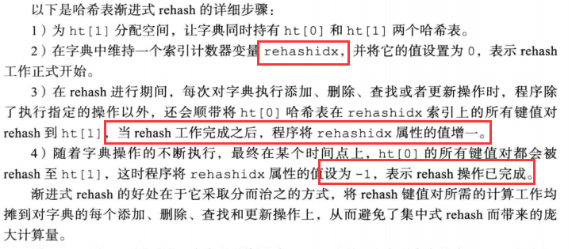
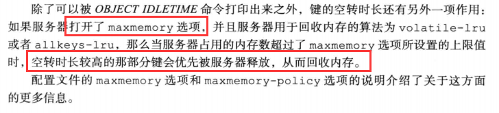
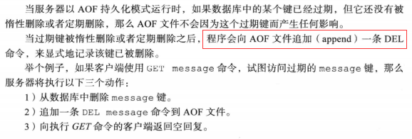
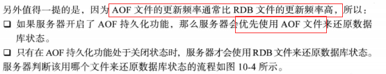
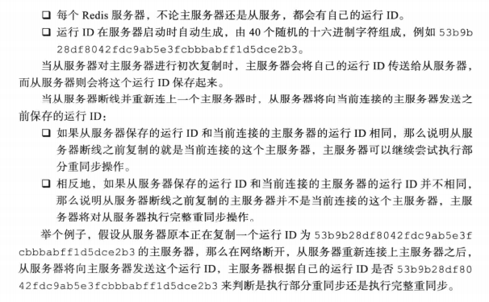

# Redis
# 一、数据结构与对象
## 2、简单动态字符串
simple dynamic string SDS 抽象类型
### 2.1、定义

SDS遵循C字符串**以空字符结尾**的惯例，保存空字符的1字节空间不计算在SDS的len属性里面，并且为空字符分配额外的1字节空间，以及添加空字符到字符串末尾等操作，都是由SDS函数自动完成的，所以这个空字符对于SDS的使用者来说是完全透明的。遵循空字符结尾这一惯例的好处是， SDS可以直接重用一部分 C字符串函数库里面的函数。

### 2.2、与C字符串的区别

- 常数复杂度获取字符串长度（len属性），C字符串不记录自身的长度信息（必须遍历获得）
- 杜绝缓冲区溢出
> C字符串不记录自身长度容易造成缓冲区溢出
> 与C字符串不同，SDS的空间分配策略完全杜绝了发生缓冲区溢出的可能性:当SDSAPI需要对SDS进行修改时，API会先检查SDS的空间是否满足修改所需的要求，如果不满足的话，API 会自动将SDS的空间扩展至执行修改所需的大小，然后才执行实际的修改操作，所以使用SDS既不需要手动修改SDS的空间大小，也不会出现前面所说的缓冲区溢出问题。

- 减少修改字符串时带来的内存重分配次数
> 正如前两个小节所说，因为C字符串并不记录自身的长度，所以对于一个包含了N个字符的C字符串来说，这个C字符串的底层实现总是-一个N+1个字符长的数组(额外的一个字符空间用于保存空字符)。因为C字符串的长度和底层数组的长度之间存在着这种关联性，所以每次增长或者缩短一个C字符串，程序都总要对保存这个C字符串的数组进行--次内存重分配操作

> 为了避免C字符串的这种缺陷，SDS通过未使用空间解除了字符串长度和底层数组长度之间的关联:在SDS中，buf数组的长度不一-定就是字符数量加一，数组里面可以包含未使用的字节，而这些字节的数量就由SDS的free属性记录。

- 优化策略
   - **空间预分配**
      - 若修改之后SDS长度小于1MB，程序分配和len属性同样大小的未使用空间，即free = len
      - 若修改之后SDS长度大于1MB，则free = 1MB
   - 惰性空间释放
> 惰性空间释放用于优化SDS的字符串缩短操作:当SDS的API需要缩短SDS保存的字符串时，程序并不立即使用内存重分配来回收缩短后多出来的字节，而是使用free属性将这些字节的数量记录起来，并等待将来使用。

- 二进制安全，可以存二进制数据
- 兼容部分C字符串函数

## 3、链表
redis> LRANGE integers 0 10 
底层实现就是一个链表
### 3.1、链表和链表节点的实现

Redis的链表实习的特性如下：

- 双端
- 无环
- 带表头指针和表尾指针
- 带链表成都计数器
- 多态：链表节点使用void*指针来保存节点值，并且可以通过list结构的dup、free、match三个属性为节点值设置类型特定函数，所以链表可以用于保存各种不同类型的值。

### 3.2、重点回顾

- 链表被广泛用于实现Redis的各种功能，比如**列表键、发布与订阅、慢查询、监视器**等。
- 每个链表节点由一个listNode结构来表示，每个节点都有一个指向前置节点和后置节点的指针，所以Redis的链表实现是双端链表。
- 每个链表使用一个list结构来表示，这个结构带有表头节点指针、表尾节点指针,以及链表长度等信息。
- 因为链表表头节点的前置节点和表尾节点的后置节点都指向NULL,所以Redis的链表实现是无环链表。
- 通过为链表设置不同的类型特定函数，Redis的链表可以用于保存各种不同类型的值。

## 4、字典
字典，又称为符号表(symboltable)、关联数组(associativearray)或映射(map),是种用于保存键值对(key-valuepair)的抽象数据结构。
### 4.1、字典的实现

1. 哈希表

    

2. 哈希表节点

3. 字典

### 4.2、哈希算法
当要将一个新的键值对添加到字典里面时，程序需要先根据键值对的键计算出哈希值和当要将一个新的键值对添加到字典里面时，程序需要先根据键值对的键计算出哈希值和索引值，然后再根据索引值,将包含新键值对的哈希表节点放到哈希表数组的指定索引

### 4.3、解决键冲突
当有两个或以上数量的键被分配到了哈希表数组的同一个索引上面时，我们称这些键发生了冲突(collision)。
Redis的哈希表使用**链地址法(separatechaining)来解决键冲突**，每个哈希表节点都有一个next指针，多个哈希表节点可以用next指针构成一个单向链表，被分配到同一个索引上的多个节点可以用这个单向链表连接起来，这就解决了键冲突的问题。由于没有尾指针，所以为了速度考虑，采取头插法。（此处类似HashMap）

### 4.4、rehash
扩展和收缩哈希表的工作可以通过执行rehash（重新散列）操作来完成，Redis对字典的哈希表执行rehash的步骤如下：

1. 为字典的ht[1]哈希表分配空间，这个空间大小取决于要执行的操作，以及ht[0].used属性的值（即当前包含的键值对数量）
   1. 如果执行的是扩展操作，那么ht[1]的大小为第一个大于等于**ht[0].used * 2 **的2的n次方幂
   1. 如果是收缩操作，大小为第一个大于等于**ht[0].used **的2的n次方幂
2. 将保存到ht[0]的所有键值对rehash到ht[1]上面：rehash指的是重新计算键的哈希值和索引值，然后将键值对放置到ht[1]哈希表的指定位置上
2. 当ht[0]包含的所有键值对都迁移到ht[1]上之后，ht[0]变成空表，释放ht[0]，将ht[1]设置为ht[0]，并在ht[1]新创建一个空白哈希表，为下一场rehash做准备

### 4.5、渐进式rehash
rehash动作并不是一次性、集中式地完成的，而是分多次、渐进式地完成的

## 5、跳跃表
是一种有序数据结构，通过在每个节点中维持多个指向其他节点的指针，从而达到快速访问节点的目的
支持平均O(logN) 最坏O(N)复杂度的节点查找 还可以通过顺序性操作来批量处理节点
Redis在两个地方用到：

- 实现有序集合键
- 在集群节点中用作内部数据结构
### 5.1、跳跃表的实现

1. 跳跃表节点

- 层
> 层的数量越多，访问其他节点的速度越快
> 每次创建新节点时，根据幂次定律（越大的数出现的概率越小）随机生成一个介于1-32的值作为level数组的大小

- 前进指针
> 每个层都有一个指向表尾方向的前进指针，用于从表头到表尾方向访问节点

- 跨度 level[i].span 记录两个节点之间的距离
- 后退指针 与前进指针想法
- 分值和成员

分值 double类型的浮点数 所有节点都按分值从小到大来排序
节点的成员对象是一个指针，指向一个字符串对象，字符串对象存着一个SDS值
**注意**：分值相同的节点将按照成员对象在字典序中的大小来进行排序

### 5.2、重点回顾

## 6、整数集合
整数集合是集合键的底层实现之一，若集合只包含整数值元素，并且这个集合的元素数量不多时，Redis就会使用整数集合
### 6.1、整数集合的实现
保存类型：int16_t, int32_t, int64_t

contents数组是整数集合的底层实现:整数集合的每个元素都是contents数组的一个数组项(item),各个项在数组中按值的大小从小到大有序地排列，并且数组中不包含任何重复项。
**contents数组的真正类型取决于encoding属性的值:**
### 6.2、升级
每当我们要将一个新元素添加到整数集合里面，并且新元素的类型比整数集合现有所有元素的类型都要长时，整数集合需要先进行升级(upgrade),然后才能将新元素添加到整数集合里面。
三步执行：

1. 根据新元素的类型，扩展整数集合底层数组的空间大小，并为新元素分配空间
1. 转换所有元素的类型
1. 将新元素加入底层数组
### 6.3、升级的好处

1. 提升灵活性
1. 节约内存
> 当然，要让一个数组可以同时保存int16_t.int32_t.int64_t三种类型的值,最简单的做法就是直接使用int64__t类型的数组作为整数集合的底层实现。不过这样一来,即使添加到整数集合里面的都是int16_t类型或者int32_t类型的值，数组都需要使用int64__t类型的空间去保存它们，从而出现浪费内存的情况。

### 6.4、降级
整数集合不支持降级操作，一旦升级编码就会保持升级后的状态
### 6.5、重点回顾

## 7、压缩列表
压缩列表(ziplist)是**列表键和哈希键**的底层实现之一。当一个列表键只包含少量列表项，并且每个列表项要么就是小整数值，要么就是长度比较短的字符串，那么Redis就会使用压缩列表来做列表键的底层实现。
### 7.1、压缩列表的构成
为了节约内存开发，由一系列特殊编码的连续内存块组成的顺序性数据结构
### 7.2、节点的构成
可以保存一个整数值或者一个字节数组

1. previous_entry_length

记录前一个节点的长度，可以是1字节或者5字节

2. encoding 记录节点content属性所保存数据的**类型以及长度**
2. content 负责保存节点的值
### 7.3、连锁更新
Redis将这种在特殊情况下产生的连续多次空间扩"展操作称之为“连锁更新"(cascadeupdate),图7-13展示了这一过程。

### 7.4、重点回顾

## 8、对象
Redis并没有直接使用这些数据结构来实现键值对数据库，而是基于这些数据结构创建了一个对象系统，这个系统包含字符串对象、列表对象、哈希对象、集合对象和有序集合对象这五种类型的对象，每种对象都用到了至少一种我们前面所介绍的数据结构。
### 8.1、对象的类型与编码

1. 类型 type

2. 编码和底层实现 encoding

### 8.2、字符串对象
字符串对象的编码可以是int、raw或者embstr。

1. 保存字符串
   1. 长度大于32字节——embstr
   1. 长度小于32字节——raw
2. 保存整数值——int
2. 编码的转换
> embstr只读 若需要转换应将它变成raw类型

  4. 字符串命令得到实现

### 8.3、列表对象
列表对象的编码可以是ziplist或者linkedlist。
#### 1、编码转换

#### 2、列表命令实现

### 8.4、哈希对象
ziplist 或者 Hashtable

#### 1、编码转换

#### 2、哈希命令的实现

### 8.5、集合对象
intset或者Hashtable
#### 1、编码转换

#### 2、集合命令的实现

### 8.6、有序集合对象
ziplist或者skiplist
#### 1、编码的转换

#### 4、有序集合命令的实现

### 8.7、类型检查与命令多态
### 8.8、内存回收
C语言不具备自动内存回收功能，Redis在自己的对象系统中构建了一个引用计数技术实现的内存回收机制，程序可以通过跟踪对象的引用计数信息，在适当的时候自动释放对象并进行内存回收

### 8.9、内存共享

### 8.10、对象的空转时长

### 8.11、重点回顾

p105

# 二、单机数据库的实现
## 9、数据库
### 9.1、服务器中的数据库
db数组
Redis服务器默认会创建16个数据库
### 9.2、切换数据库
默认情况下，Redis客户端的目标数据库为0号数据库，但客户端可以通过执行SELECT命令来切换目标数据库。
### 9.3、数据库键空间
Redis是一个键值对(key-valuepair)数据库服务器，服务器中的每个数据库都由-一个redis.h/redisDb结构表示，其中，redisDb结构的dict字典保存了数据库中的所有键值对，我们将这个字典称为键空间(keyspace):
### 9.4、设置键的生存时间或过期时间

### 9.5、过期键删除策略
#### 1、定时删除
在设置键的过期时间的同时，创建一个定时器(timer),让定时器在键的过期时间来临时，立即执行对键的删除操作。
**定时删除策略对内存是最友好的**:通过使用定时器，定时删除策略可以保证过期键会尽可能快地被删除，并释放过期键所占用的内存。
另一方面，定时删除策略的**缺点是，它对CPU时间是最不友好的**:在过期键比较多的情况下，删除过期键这一行为可能会占用相当-部分CPU时间，在内存不紧张但是CPU时间非常紧张的情况下，将CPU时间用在删除和当前任务无关的过期键上，无疑会对服务器的响应时间和吞吐量造成影响。

#### 2、惰性删除
**惰性删除策略对CPU时间来说是最友好的:程序只会在取出键时才对键进行过期检查**，这可以保证删除过期键的操作只会在非做不可的情况下进行，并且删除的目标仅限于当前处理的键，这个策略不会在删除其他无关的过期键上花费任何CPU时间。**惰性删除策略的缺点是，它对内存是最不友好的**:如果一个键已经过期，而这个键又仍然保留在数据库中，那么只要这个过期键不被删除，它所占用的内存就不会释放。

#### 3、定期删除

### 9.6、Redis的过期键删除策略
Redis实际使用的惰性删除和定期删除
#### 1、惰性删除策略的实现

#### 2、定期删除策略的实现

### 9.7、AOF、RDB和复制功能对过期键的处理
#### 1、生成RDB文件

#### 2、载入RDB文件

#### 3、AOF文件写入

#### 4、AOF重写

#### 5、复制

### 9.8、数据库通知
数据库通知是Redis2.8版本新增加的功能，这个功能可以让客户端通过订阅给定的频道或者模式，来获知数据库中键的变化，以及数据库中命令的执行情况。
这一类关注“某个键执行了什么命令”的通知称为**键空间通知**(key-spacenotifcation),除此之外，还有另一类称为**键事件通知**(key-eventnotification)的通知，它们关注的是“某个命令被什么键执行了”

### 9.9、重点回顾

## 10、RDB持久化
Redis 提供了RDB持久化功能，**这个功能可以将Redis在内存中的数据库状态保存到磁盘里面，避免数据意外丢失。**
****

### 10.1、RDB文件的创建和载入
两个命令：

- SAVE：会阻塞Redis服务器进程，直到RDB文件创建完毕为止
- BGSAVE：派生出一个子进程，由子进程负责创建RDB文件，服务器进程继续处理命令请求

和使用SAVE命令或者BGSAVE命令创建RDB文件不同，RDB文件的载人工作是在服务器启动时自动执行的，**所以Redis并没有专门用于载人RDB文件的命令，只要Redis服务器在启动时检测到RDB文件存在，它就会自动载人RDB文件。**
服务器在载入RDB文件期间，会一直处于阻塞状态
****
### 10.2、自动间隔性保存
#### 1、设置保存条件

#### 2、dirty计数器和lastsave属性

#### 3、检查保存条件是否满足
### 10.3、RDB文件结构

一个RDB文件的databases部分可以保存任意多个非空数据库。

### 10.4、重点回顾

## 11、AOF持久化

### 11.1、AOF持久化的实现
#### 1、命令追加（append）

#### 2、AOF文件的写入与同步

### 11.2、AOF文件的载入与数据还原

### 11.3、AOF重写

#### 1、AOF重写的实现

#### 2、后台重写 164
在重写AOF文件期间，服务期将无法处理客户端发来的命名请求
所以Redis决定将AOF重写程序放到子进程里执行
设置一个AOF重写缓冲区，在服务器创建子进程之后开始使用，当执行一个写命令之后会同时把这个写命令发送给AOF缓冲区和AOF重写缓冲区，保证数据一致性

### 11.4、重点回顾

## 12、事件
### 12.1、文件事件
Redis基于Reactor模式开发了自己的网络事件处理器：文件事件处理器

- 使用I/O多路复用程序来同时监听多个套接字，并根据套接字目前执行的任务来为套接字关联不同的事件处理器
- 当被监听的套接字准备好执行连接应答(accept).读取(read).写人(write).关闭(close)等操作时，与操作相对应的文件事件就会产生，这时文件事件处理器就会调用套接字之前关联好的事件处理器来处理这些事件。

**虽然文件事件处理器以单线程方式运行**，但**通过使用IO多路复用程序来监听多个套接字**，文件事件处理器既实现了高性能的网络通信模型，又可以很好地与Redis服务器中其他同样以单线程方式运行的模块进行对接，这保持了Redis内部单线程设计的简单性。
#### 1、文件事件处理器的构成

#### 2、I/O多路复用程序的实现

### 12.2、时间事件

- 定时事件
- 周期性事件

目前版本只使用周期性事件，没使用定时事件

### 12.3、事件的调度与执行
因为服务器中同时存在文件事件和时间事件两种事件类型，所以服务器必须对这两种事件进行调度，决定何时应该处理文件事件，何时又应该处理时间事件，以及花多少时间来处理它们等等。

### 12.4、重点回顾

## 13、客户端
### 13.1、客户端属性
#### 1、套接字描述符fd
客户端状态的fd属性记录了客户端正在使用的套接字描述符:
#### 2、名字 
client setname ，默认没有名字
#### 3、标志

### 13.2、客户端的创建与关闭
clients链表
载入AOF文件时，会创建用于执行AOF文件包含的Redis命令的伪客户端
### 13.3、重点回顾

## 14、服务器

# 三、多机数据库的实现
## 15、复制
SLAVEOF

### 15.1、旧版复制功能的实现
两个操作：

- 同步操作 将从服务器的数据库状态更新至主服务器当前所处的数据库状态
- 命令传播工作 在主服务器的数据库状态被修改，导致主从服务器的数据库状态出现不一致时，让主从服务器的数据库重新回到一致状态
#### 1、同步

#### 2、命令传播

### 15.2、旧版复制功能的缺陷
复制的两种情况

1. 初次复制
1. 断线后重复制:处于命令传播阶段的主从服务器因为网络原因而中断了复制，但从服务器通过自动重连接重新连上了主服务器，并继续复制主服务器。

### 15.3、新版复制功能的实现
PSYNC的两种模式

- **完整重同步：**处理初次复制情况，完整重同步的执行步骤和SYNC命令的执行步骤基本一样，它们都是通过让主服务器创建并发送RDB文件，以及向从服务器发送保存在缓冲区里面的写命令来进行同步。
- **部分重同步**：而部分重同步则用于处理断线后重复制情况:当从服务器在断线后重新连接主服务器时，如果条件允许，主服务器可以将主从服务器连接断开期间执行的写命令发送给从服务器，从服务器只要接收并执行这些写命令，就可以将数据库更新至主服务器当前所处的状态。

### 15.4、部分重同步的实现

#### 1、复制偏移量

根据复制偏移量确定主从服务器是否处于一致状态

#### 2、复制积压缓冲区
主服务器维护，固定长度先进先出队列，默认大小是1MB
主服务器命令传播时，不仅会将写命令发送给所有从服务器，还会将写命令入队到复制积压缓存区

因此，主服务器的复制积压缓冲区里面会保存着一部分最近传播的写命令，并且复**制积压缓冲区会为队列中的每个字节记录相应的复制偏移量**，就像表15-4展示的那样。

#### 3、服务器运行ID

### 15.5、PSYNC命令的实现

### 15.6、复制的实现（☆）

1. **设置主服务器的地址和端口**
1. **建立套接字连接**

3. **发送PING命令**
   1. 检查套接字的读写状态是否正常
   1. 检查主服务器能否正常处理命令请求
   1. 如果从服务器读取到PONG回复，表示主从服务器之间的网络连接状态正常
4. **身份验证**
   1. 主服务器设置了masterauth，进行身份验证；没设置就不需要
   1. 主服务器设置requirepass，从服务器没设置masterauth选项，返回NOAUTH错误；反之返回no password is set

5. **发送端口信息**

6. **同步PSYNC**

7. **命令传播**

完成了同步之后，主从服务器就会进入命令传播阶段，这时**主服务器只要一直将自己执行的写命令发送给从服务器**

### 15.7、心跳检测
REPLCONF ACK命令

### 15.8、重点回顾

## 16、哨兵Sentinel
## 17、集群
